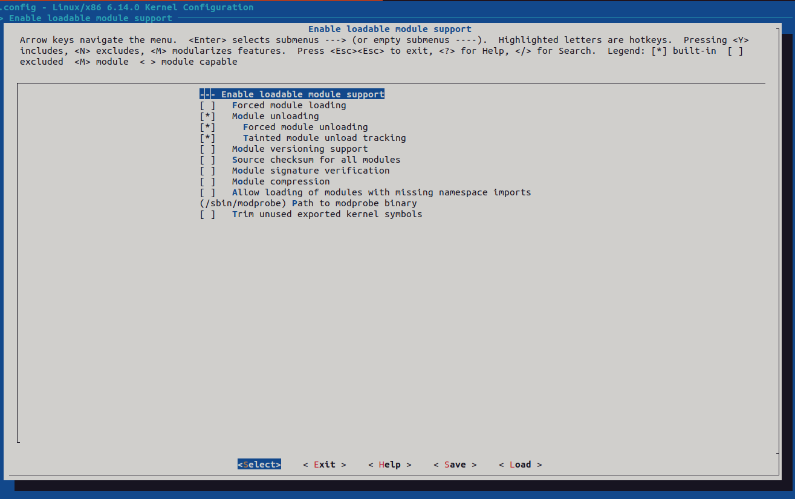
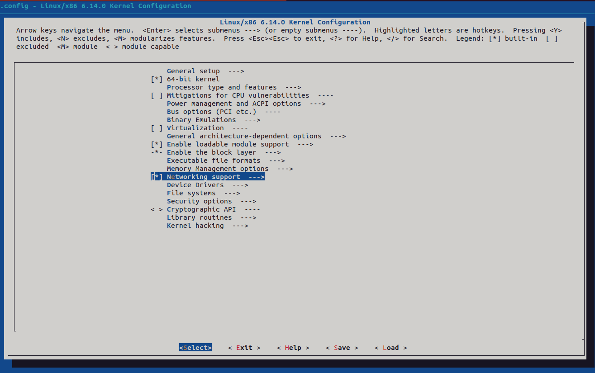
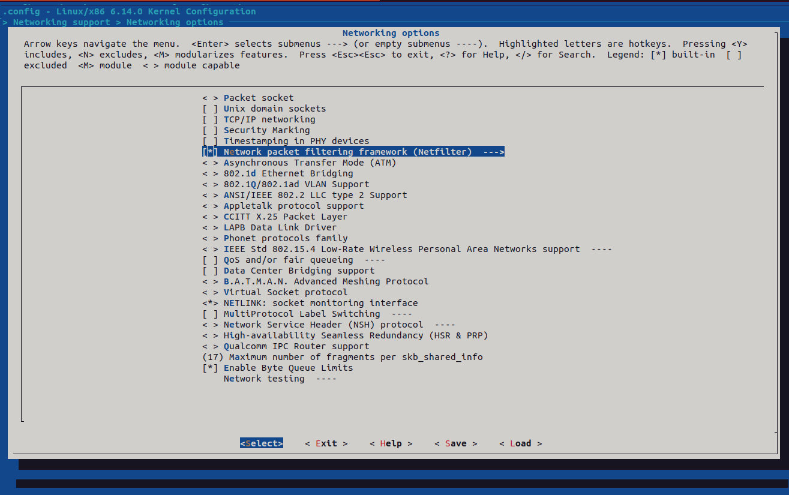

# Módulo 3: Módulos del kernel

## Objetivo
Aprender a crear, compilar, instalar y cargar módulos en el kernel mínimo generado en el capítulo anterior.

---

### 1. Crear un módulo básico: `hello.c`

Primero, crearemos un módulo básico llamado `hello.c`. Este módulo imprimirá un mensaje al cargarse y descargarse del kernel. El código fuente del módulo se encuentra en el archivo [`hello.c`](03-modulos-del-kernel/hello.c).

---

### 2. Crear un Makefile para compilar el módulo

Creamos un archivo `Makefile` para compilar el módulo. El contenido del Makefile se encuentra en [`Makefile`](03-modulos-del-kernel/Makefile).

---

### 3. Recompilar el kernel con soporte para módulos

Para habilitar o deshabilitar el soporte para módulos, recompilaremos el kernel con la opción correspondiente.

**Comandos:**
```bash
make O=$LINUX_BUILD_DIR menuconfig
```

Dentro de "General setup", activa la opción "Enable loadable module support".



Luego, recompila el kernel:
```bash
make O=$LINUX_BUILD_DIR -j$(nproc)
```

---

### 4. Compilar el módulo

Antes de compilar el módulo, prepara el entorno para módulos:
```bash
make O=$LINUX_BUILD_DIR modules_prepare
```

Luego, compila los modulos para generar ```Module.symvers```:
```bash
make O=$LINUX_BUILD_DIR modules
```

Ahora, compila el módulo `hello.c`:
```bash
make -C /path/to/kernel O=$LINUX_BUILD_DIR M=$PWD modules
```
Asegúrate de reemplazar `/path/to/kernel` con la ruta correcta al directorio del kernel.

Esto generará un archivo `hello.ko`, que es el módulo compilado.

---

### 5. Mover el módulo al initramfs

Para que el módulo esté disponible en el sistema mínimo, copia el archivo `hello.ko` al initramfs.

**Comandos:**
```bash
cp hello.ko /home/$USER/initramfs/lib/modules/$(uname-r)
```

Usa ```modules_install``` para instalar el módulo en el initramfs:
```bash
make -C /path/to/kernel O=$LINUX_BUILD_DIR M=$PWD modules_install INSTALL_MOD_PATH=/home/$USER/initramfs
```


Actualiza el initramfs:
```bash
cd /home/$USER/initramfs
find . -print0 | cpio --null --create --verbose --format=newc | gzip --best > ./custom-initramfs.cpio.gz
```

---

### 6. Cargar y descargar el módulo en QEMU

Ejecuta el kernel con el initramfs actualizado:
```bash
qemu-system-x86_64 -kernel $LINUX_BUILD_DIR/arch/x86/boot/bzImage -nographic -append "earlyprintk=serial,ttyS0 console=ttyS0 debug" --initrd $INITRAMFS_DIR
```

Dentro del sistema mínimo, carga el módulo:
```bash
insmod /lib/modules/hello.ko
dmesg | tail -n 20
```

Verifica que el módulo esté cargado:
```bash
lsmod
```

Consulta información sobre el módulo:
```bash
modinfo /lib/modules/hello.ko
```

Descarga el módulo:
```bash
rmmod hello
dmesg | tail -n 20
```

Verifica que se haya descargado:
```bash
lsmod
```

---

### 7. Cargar y probar el módulo `proc_example`

El módulo [`proc_example.c`](03-modulos-del-kernel/proc_example.c) crea una entrada en el sistema de archivos `/proc` llamada `proc_example`. Este archivo permite leer información desde el espacio de usuario, lo que es útil para interactuar con el kernel. Recuerda que el módulo `proc_example` debe ser compilado y copiado al initramfs de la misma manera que hiciste con `hello.c`.

#### Cargar el módulo
Dentro del sistema mínimo, carga el módulo:
```bash
insmod /lib/modules/proc_example.ko
```

Verifica que el módulo esté cargado:
```bash
lsmod
```

#### Leer del archivo `/proc/proc_example`
Usa el comando `cat` para leer la información proporcionada por el módulo:
```bash
cat /proc/proc_example
```

#### Descargar el módulo
Descarga el módulo:
```bash
rmmod proc_example
```

Verifica que se haya descargado:
```bash
lsmod
```
---

### 8. Cargar y probar el módulo `dev_example`

El módulo [`dev_example.c`](03-modulos-del-kernel/dev_example.c) implementa un controlador de dispositivo de carácter. Este módulo permite interactuar con el kernel mediante operaciones de lectura y escritura desde el espacio de usuario. Recuerda que el módulo `dev_example` debe ser compilado y copiado al initramfs de la misma manera que hiciste con `hello.c`.

#### Cargar el módulo
Dentro del sistema mínimo, carga el módulo:
```bash
insmod /lib/modules/dev_example.ko
```

Verifica que el módulo esté cargado:
```bash
lsmod
```

Lee los datos del dispositivo:
```bash
cat /dev/dev_example
```

#### Descargar el módulo
Descarga el módulo:
```bash
rmmod dev_example
```

Verifica que se haya descargado:
```bash
lsmod
```
---

### 9. Cargar y probar el módulo `netlink_example`

El módulo [`netlink_example.c`](03-modulos-del-kernel/netlink_example.c) implementa una interfaz de comunicación entre el espacio de usuario y el espacio del kernel utilizando sockets Netlink. Para probar este módulo, también utilizaremos un programa de usuario llamado [`netlink_example_user.c`](03-modulos-del-kernel/netlink_example_user.c).

Se debe recompilar el kernel con soporte para Netlink. Asegúrate de que el kernel tenga habilitado el soporte para Netlink. Puedes verificarlo en la configuración del kernel (`.config`) buscando la opción `CONFIG_NETLINK`.





#### Cargar el módulo
Dentro del sistema mínimo, carga el módulo:
```bash
insmod /lib/modules/netlink_example.ko
```

Verifica que el módulo esté cargado:
```bash
lsmod
```

#### Compilar el programa de usuario
Compila el programa de usuario de forma estática en tu sistema anfitrión:
```bash
gcc -o netlink_example_user netlink_example_user.c -static
```

Copia el binario al initramfs para que esté disponible dentro del sistema mínimo:
```bash
cp netlink_example_user /home/$USER/initramfs/usr/bin/
```

Actualiza el initramfs:
```bash
cd /home/$USER/initramfs
find . -print0 | cpio --null --create --verbose --format=newc | gzip --best > ./custom-initramfs.cpio.gz
```

#### Ejecutar el programa de usuario
Dentro del sistema mínimo, ejecuta el programa de usuario para interactuar con el módulo:
```bash
/usr/bin/netlink_example_user
```

Verifica los mensajes intercambiados entre el espacio de usuario y el kernel utilizando:
```bash
dmesg | tail -n 20
```

#### Descargar el módulo
Descarga el módulo:
```bash
rmmod netlink_example
```

Verifica que se haya descargado:
```bash
lsmod
```

---

### 10. Resumen

En este módulo, aprendiste a trabajar con módulos avanzados como controladores de dispositivos de carácter y sockets Netlink. También exploraste cómo interactuar con el kernel desde el espacio de usuario utilizando programas personalizados.