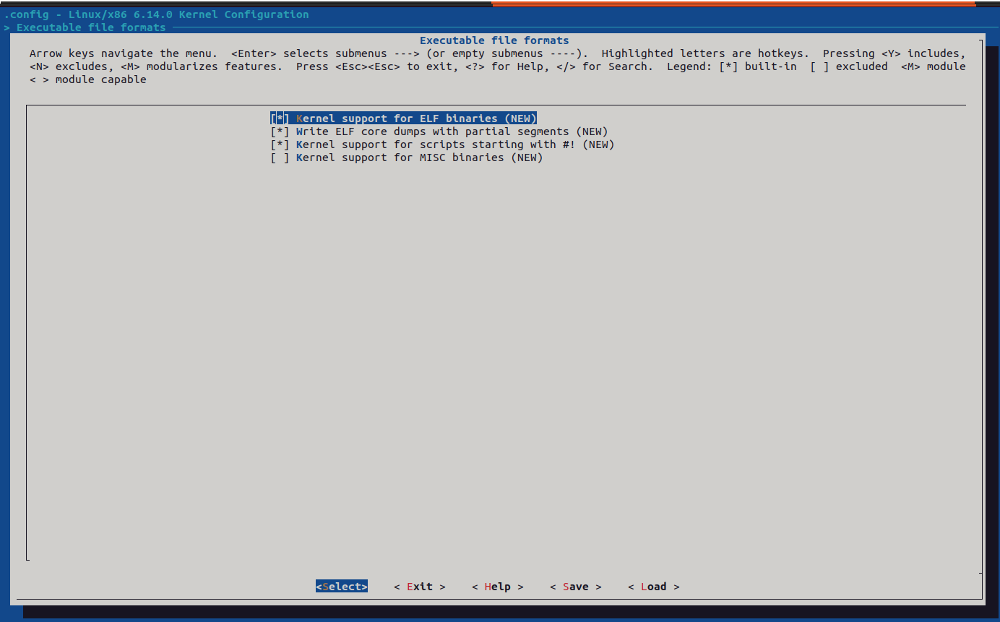

# Módulo 2: Entorno de desarrollo

## Objetivo
Preparar un entorno de desarrollo para compilar y ejecutar el kernel de Linux en un entorno controlado utilizando QEMU y herramientas básicas.

---

### 1. Instalación de herramientas básicas en Ubuntu
Primero, instalaremos las herramientas necesarias para compilar el kernel y ejecutar QEMU.

**Comandos:**
```bash
sudo apt update
sudo apt install -y build-essential libncurses-dev bison flex libssl-dev libelf-dev qemu-system gcc make gdb cscope
```

### 2. Descargar el código fuente del kernel

Descargaremos el código fuente del kernel desde el repositorio oficial y nos moveremos a la rama del último tag estable.

**Comandos:**
```bash
git clone https://git.kernel.org/pub/scm/linux/kernel/git/torvalds/linux.git/
cd linux
git checkout v6.14
```

v6.14 es un ejemplo, puedes usar la última versión estable.

### 3. Configuración del kernel

Primero limpiamos cualquier configuración previa:
```bash
make clean
make mrproper
```
Luego, configuramos el kernel. Puedes usar una configuración por defecto o personalizarla.
```bash
LINUX_BUILD_DIR=/home/$USER/linux/build
mkdir build
make O=$LINUX_BUILD_DIR allnoconfig
make O=$LINUX_BUILD_DIR menuconfig
```
Por el momento dejamos la configuración por defecto y salimos.

### 4. Compilación del kernel
Compilamos el kernel y los módulos. Esto puede tardar un tiempo dependiendo de tu máquina.
```bash
make -j$(nproc)
```

### 5. Ejecutar el kernel en QEMU

Para ejecutar el kernel compilado en QEMU:
```bash
qemu-system-x86_64 -kernel $LINUX_BUILD_DIR/arch/x86/boot/bzImage -nographic -append "earlyprintk=serial,ttyS0 console=ttyS0"
```
 Inicialmente, esto generará un ***kernel panic*** porque no hay un sistema de archivos raíz. Para salir de quemu puedes usar `Ctrl + A` seguido de `X`.

### 6. Descargar y compilar BusyBox

BusyBox es una herramienta que proporciona un conjunto de utilidades Unix en un solo ejecutable. Lo usaremos como sistema de archivos raíz.

**Comandos:**
```bash
curl https://busybox.net/downloads/busybox-1.37.0.tar.bz2 --output busybox-1.37.0.tar.bz2
tar -xvf busybox-1.37.0.tar.bz2
rm busybox-1.37.0.tar.bz2
cd busybox-1.37.0
make clean
make distclean
mkdir build
OUTPUT_DIR=/home/$USER/busybox-1.37.0/build
make O=$OUTPUT_DIR defconfig
make O=$OUTPUT_DIR menuconfig
```

Selecciona dentro de "Settings" la opción "Build static binary (no shared libs)" para compilar BusyBox como un binario estático.
Esto es útil para evitar problemas de dependencias al ejecutar en QEMU.


Podemos hacer el build de busybox

```bash
make O=$OUTPUT_DIR -j$(nproc) busybox
```

Podemos verificar el binario de busybox con
```bash
ls -la $OUTPUT_DIR --block-size=KB | grep busybox
```

### 7. Crear un initramfs

Crearemos un sistema de archivos raíz inicial (initramfs) utilizando BusyBox.

**Comandos:**

```bash
mkdir /home/$USER/initramfs && cd initramfs
cd initramfs
mkdir -p {bin,dev,etc,proc,sbin,sys,usr/{bin,sbin}}
sudo mknod -m 622 dev/console c 5 1       
sudo mknod -m 666 dev/tty c 5 0
cp /home/$USER/busybox-1.37.0/build/busybox bin/busybox
```

Crear el init process

```bash
touch init && chmod +x init
```

Y completar el archivo con

```bash
#!/bin/busybox sh

# Hacer que busybox cree los softlinks
/bin/busybox --install -s
# Montar /proc and /sys filesystems.
# Se puede omitir pero queda prolijo haciendolo así
mount -t proc none /proc
mount -t sysfs none /sys
# Cargar el shell, que debería estar linkeado a busybox
exec /bin/sh
```

Con ```cpio``` creamos el initramfs

```bash
find . -print0 | cpio --null --create --verbose --format=newc | gzip --best > ./custom-initramfs.cpio.gz
```

### 8. Recompilar el kernel con soporte para initramfs

Para que el kernel reconozca el initramfs, debemos recompilarlo con soporte para initramfs. Activaremos también otras opciones.

```bash
make O=$LINUX_BUILD_DIR menuconfig
```

Dentro de "General setup" activamos "Initial RAM filesystem and RAM disk (initramfs/initrd) support".


Activamos la opción de 64 bits


Activamos dentro de "Executable file formats" el soporte para ```#!```


Activamos el soporte para serial 8250/16550 y la consola compatible en serial port


Hacemos el build del kernel nuevamente
```bash
make O=$LINUX_BUILD_DIR -j$(nproc)
```

Corremos el kernel con la referencia al initramfs
```bash
INITRAMFS_DIR=/home/$USER/initramfs/custom-initramfs.cpio.gz
qemu-system-x86_64 -kernel $LINUX_BUILD_DIR/arch/x86/boot/bzImage -nographic -append "earlyprintk=serial,ttyS0 console=ttyS0 debug" --initrd $INITRAMFS_DIR
```
Si todo salió bien, deberías ver el prompt de BusyBox.
```bash
/ # 
```

En mi caso encontré el siguiente inconveniente:
```bash
/bin/sh: can't access tty; job control turned off
~ #
```

Lo pude resolver agregando getty al build de busybox y al init

```bash
make o=$OUTPUT_DIR menuconfig
```

Dentro de "Login/Passwords Management Utilities" activamos "getty"


Dentro del directorio de initramfs editamos el init copiamos el nuevo binario de busybox y lo agregamos al init
```bash
cp /home/$USER/busybox-1.37.0/build/busybox bin/busybox
```

Agregamomos en el menuconfig del kernel el soporte para devtmpfs

```bash
make O=$LINUX_BUILD_DIR menuconfig
```

Dentro de "Devices Drivers" activamos "devtmpfs filesystem support" y "automount devtmpfs at /dev"


creamos en el directorio de initramfs el directorio dev y creamos los nodos de dispositivo
```bash
mkdir dev
sudo mknod -m 622 dev/console c 5 1
sudo mknod -m 666 dev/tty c 5 0
```

Y editamos el init para montar el devtmpfs, ejecutar getty y dar mensaje al inicio.

```bash
#!/bin/busybox sh

# Hacer que busybox cree los softlinks
/bin/busybox --install -s
# Montar /proc and /sys filesystems.
# Se puede omitir pero queda prolijo haciendolo así
mount -t devtmpfs devtmpfs /dev
mount -t proc none /proc
mount -t sysfs none /sys
# Cargar el shell via getty
echo "Boot OK. Starting shell..."
exec /sbin/getty -n -l /bin/sh 115200 ttyS0
```

Empaquetamos el initramfs nuevamente
```bash
find . -print0 | cpio --null --create --verbose --format=newc | gzip --best > ./custom-initramfs.cpio.gz
```

Y corremos nuevamente el kernel
```bash
qemu-system-x86_64 -kernel $LINUX_BUILD_DIR/arch/x86/boot/bzImage -nographic -append "earlyprintk=serial,ttyS0 console=ttyS0 debug" --initrd $INITRAMFS_DIR
```

Si todo salió bien, deberías ver el prompt de BusyBox.
```bash
/ # ls
bin                       init                      sbin
custom-initramfs.cpio.gz  linuxrc                   sys
dev                       proc                      usr
etc                       root
~ # 
```

Y podremos navegar por el filesystem de nuestro sistema minimo.
